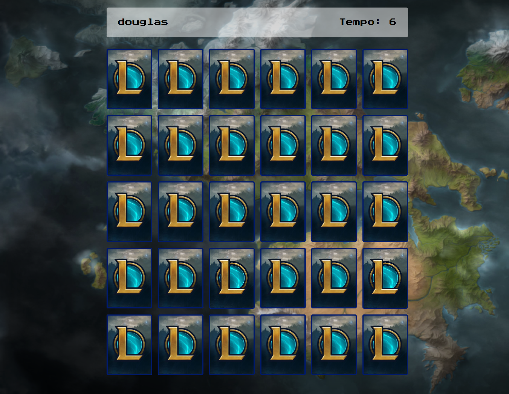

# Jogo da memoria

## [Acesse aqui](https://douglas-jpg.github.io/Jogo-da-memoria/)

> Um simples jogo da memoria ultilizando HTML, CSS e JavaScript no tema de league of legendes.

### Ajustes e melhorias

O projeto ainda está em desenvolvimento e as próximas atualizações serão voltadas nas seguintes tarefas:

- [X] Tela de Login 
- [ ] Raking do menor tempo para resolver o jogo

## 📝 Licença

Esse projeto está sob licença. Veja o arquivo [LICENSE.md](https://www.mit.edu/~amini/LICENSE.md) para mais detalhes.
